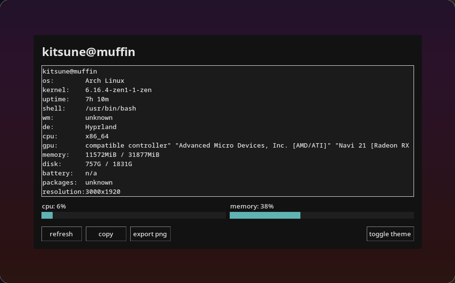

# nekofetch



**nekofetch** is a neofetch-inspired system info viewer with a soft gradient GUI, live CPU/memory meters, and cute export options for screenshots. Perfect for showing off your cozy desktop setup :3

---

## Features
- Live CPU and memory meters with smooth animation
- Dark/Light mode toggle
- Export your system info as PNG - This is broken in most cases (LINUX)
- Copy system stats to clipboard
- Detects OS, kernel, shell, DE, WM, GPU, packages, resolution, battery, and more
- Minimal dependencies: Python 3, `psutil`, `Pillow`, `tkinter`

---

## Installation

```bash
git clone https://github.com/hnpf/nekofetch.git
cd nekofetch
python3 -m venv venv
source venv/bin/activate.fish  # if using fish shell
# or
source venv/bin/activate        # bash/zsh
pip install -r requirements.txt
python nekofetch.py
For CLI:
chmod +x nekofetchcli.sh
./nekofetchcli.sh
```
---
## Usage
- Run python nekofetch.py to launch the GUI

- Use refresh to update stats

- Copy to clipboard

- Export PNG to save a snapshot of your setup

- Toggle between Dark/Light themes
---
## License
- MIT License - Feel free to fork, modify, and share!
---
## nekofetch - system stats for humans and cats alike! :3
